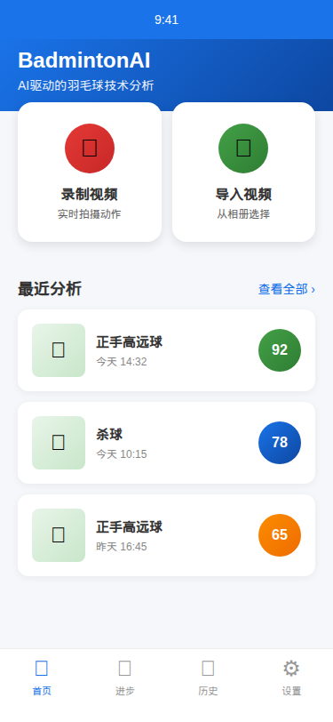
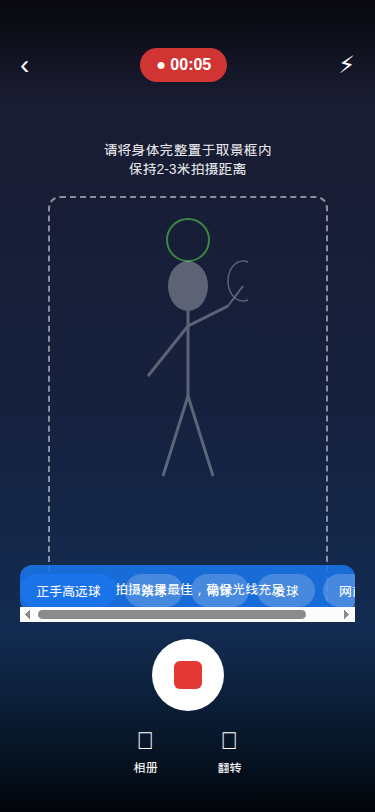
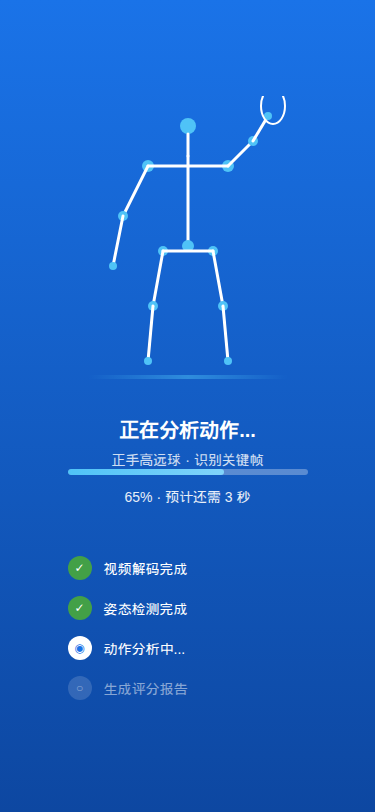
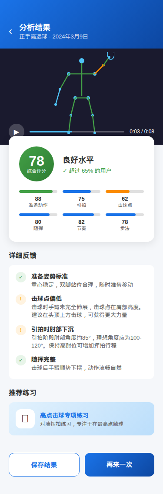
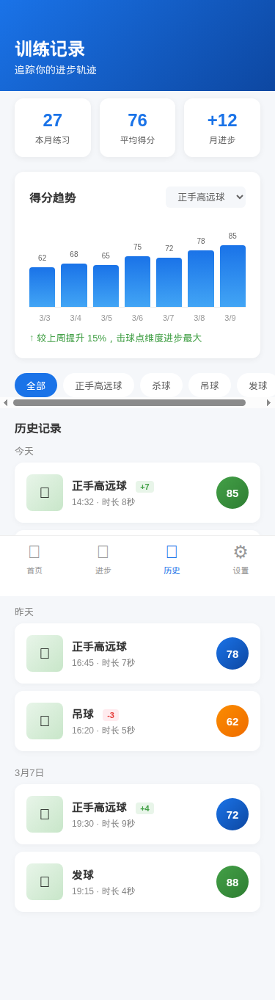

# BadmintonAI - Product Requirements Document

## 1. Product Overview

### 1.1 Product Vision
BadmintonAI is an Android application that uses AI-powered pose estimation to analyze badminton players' techniques, provide real-time scoring, and deliver personalized coaching feedback to help players improve their skills.

### 1.2 Target Users
| User Type | Description | Pain Points |
|-----------|-------------|-------------|
| Amateur Players | Recreational players wanting to improve | No access to professional coaching, can't see own form |
| Intermediate Players | Club-level players seeking technique refinement | Need objective feedback on specific strokes |
| Coaches | Badminton coaches training multiple students | Time-consuming to analyze each student's videos manually |
| Self-learners | Players learning from online tutorials | Can't verify if they're executing techniques correctly |

### 1.3 Core Value Proposition
- **Accessible Coaching**: Professional-level technique analysis without hiring a coach
- **Objective Feedback**: AI-based scoring removes subjective bias
- **Instant Analysis**: Real-time or near-real-time feedback during practice
- **Progress Tracking**: Historical data to visualize improvement over time

---

## 2. Technical Feasibility Analysis

### 2.1 Pose Estimation Technology Options

| Technology | Provider | Keypoints | Performance | Pros | Cons |
|------------|----------|-----------|-------------|------|------|
| **MediaPipe Pose** | Google | 33 full-body | ~30 FPS on mid-range | Cross-platform, 3D coords, open-source | Requires custom analysis layer |
| **ML Kit Pose Detection** | Google | 33 landmarks | 23-30 FPS | Easy Firebase integration, two accuracy modes | Limited customization |
| **QuickPose SDK** | QuickPose.ai | 33 points | Optimized for NPU | Pre-built sports features, rep counting | Commercial licensing |
| **TensorFlow Lite (MoveNet)** | Google | 17 keypoints | ~30 FPS | Lightweight, proven accuracy | Fewer keypoints than alternatives |

**Recommendation**: MediaPipe Pose as primary solution
- Full 33-point skeleton including hands (important for grip analysis)
- 3D world coordinates enable depth-aware analysis
- Apache 2.0 license, no cloud dependency
- Strong community support and documentation

### 2.2 Academic Research Insights

Recent research (2024-2025) validates the feasibility:
- **Nature Scientific Reports (2025)**: Machine learning models can classify badminton stroke types with high accuracy using pose keypoints
- **BST Transformer**: State-of-the-art stroke classification using skeleton data + shuttlecock trajectory
- **MultiSenseBadminton Dataset**: Comprehensive dataset with 7,763 swings across skill levels proves biomechanical analysis is viable
- **AI-Powered Training Systems**: Frame-by-frame correction systems using MediaPipe are already demonstrated

---

## 3. Functional Requirements

### 3.1 Core Features (MVP - Phase 1)

#### F1: Video Recording & Import
| ID | Requirement | Priority |
|----|-------------|----------|
| F1.1 | Record video using device camera (rear/front) | P0 |
| F1.2 | Import existing videos from gallery | P0 |
| F1.3 | Support video formats: MP4, MOV, AVI | P0 |
| F1.4 | Recommended recording guidance (distance, angle, lighting) | P1 |

#### F2: Pose Detection & Tracking
| ID | Requirement | Priority |
|----|-------------|----------|
| F2.1 | Detect 33 body landmarks using MediaPipe Pose | P0 |
| F2.2 | Track pose across video frames | P0 |
| F2.3 | Handle single-player detection | P0 |
| F2.4 | Output 3D world coordinates for depth analysis | P1 |
| F2.5 | Skeleton overlay visualization on video | P0 |

#### F3: Stroke Recognition
| ID | Requirement | Priority |
|----|-------------|----------|
| F3.1 | Identify stroke type from motion sequence | P0 |
| F3.2 | Supported strokes (MVP): Forehand Clear, Backhand Clear, Smash, Drop Shot, Serve | P0 |
| F3.3 | Auto-detect stroke start/end frames | P1 |
| F3.4 | Manual stroke marking as fallback | P1 |

**Supported Stroke Types:**
```
Phase 1 (MVP):
├── Overhead Strokes
│   ├── Forehand Clear (高远球)
│   ├── Smash (杀球)
│   └── Drop Shot (吊球)
├── Underhand Strokes
│   └── Serve (发球)
└── Net Play
    └── Net Shot (网前球)

Phase 2 (Future):
├── Backhand Clear (反手高远球)
├── Drive (平抽球)
├── Lift (挑球)
└── Footwork Analysis (步法分析)
```

#### F4: Technique Scoring System
| ID | Requirement | Priority |
|----|-------------|----------|
| F4.1 | Generate overall score (0-100) for each stroke | P0 |
| F4.2 | Provide sub-scores for key technique dimensions | P0 |
| F4.3 | Compare against reference "ideal form" models | P0 |
| F4.4 | Display score breakdown with visual indicators | P0 |

**Scoring Dimensions:**

| Dimension | Weight | Metrics Analyzed |
|-----------|--------|------------------|
| **Preparation** | 20% | Ready position, racket preparation angle, split step |
| **Backswing** | 15% | Elbow height, shoulder rotation, weight transfer |
| **Contact Point** | 25% | Arm extension, contact height, body alignment |
| **Follow-through** | 15% | Swing completion, balance maintenance |
| **Timing & Rhythm** | 15% | Movement fluidity, acceleration curve |
| **Footwork** | 10% | Base position, recovery step |

#### F5: Coaching Feedback
| ID | Requirement | Priority |
|----|-------------|----------|
| F5.1 | Generate text-based feedback for each scoring dimension | P0 |
| F5.2 | Highlight specific improvement areas | P0 |
| F5.3 | Provide actionable correction suggestions | P0 |
| F5.4 | Show visual comparison: user vs ideal form | P1 |
| F5.5 | Support feedback in Chinese (Simplified) | P0 |

**Feedback Examples:**
```
Score: 72/100 - Forehand Clear

✓ Good: Preparation stance is solid, weight on back foot
⚠ Improve: Contact point is too low (shoulder height detected, should be above head)
⚠ Improve: Elbow drops before contact - maintain high elbow position
✗ Issue: Follow-through incomplete - extend arm fully toward target

Drill Suggestion: Practice shadow swings focusing on high contact point
```

### 3.2 Extended Features (Phase 2)

#### F6: Progress Tracking
| ID | Requirement | Priority |
|----|-------------|----------|
| F6.1 | Store historical analysis results | P1 |
| F6.2 | Display score trends over time (charts) | P1 |
| F6.3 | Track improvement per stroke type | P1 |
| F6.4 | Set personal goals and track progress | P2 |

#### F7: Real-time Analysis Mode
| ID | Requirement | Priority |
|----|-------------|----------|
| F7.1 | Live camera preview with pose overlay | P1 |
| F7.2 | Real-time audio/visual feedback during practice | P2 |
| F7.3 | Session recording with analysis | P2 |

#### F8: Social & Sharing
| ID | Requirement | Priority |
|----|-------------|----------|
| F8.1 | Export analysis results as video/image | P2 |
| F8.2 | Share to social platforms | P2 |
| F8.3 | Compare with friends | P3 |

---

## 4. Non-Functional Requirements

### 4.1 Performance
| Metric | Target | Notes |
|--------|--------|-------|
| Video analysis speed | ≤2x real-time | 10s video analyzed in ≤20s |
| Pose detection FPS | ≥20 FPS | On mid-range devices (Snapdragon 6-series) |
| App startup time | <3s | Cold start to main screen |
| Memory usage | <500MB | During video analysis |

### 4.2 Device Compatibility
| Requirement | Specification |
|-------------|---------------|
| Minimum Android version | Android 8.0 (API 26) |
| Target Android version | Android 14 (API 34) |
| Minimum RAM | 4GB |
| Camera | Required (for recording feature) |
| GPU | Recommended for real-time analysis |

### 4.3 Privacy & Data
| Requirement | Description |
|-------------|-------------|
| On-device processing | All pose analysis runs locally, no cloud upload |
| Video storage | User controls video retention |
| No account required | Core features work without login |
| GDPR/Privacy compliance | Clear data handling disclosure |

### 4.4 Localization
| Language | Priority |
|----------|----------|
| Simplified Chinese | P0 |
| English | P1 |

---

## 5. Technical Architecture

### 5.1 High-Level Architecture

```
┌─────────────────────────────────────────────────────────────┐
│                      Presentation Layer                      │
│  ┌──────────┐  ┌──────────┐  ┌──────────┐  ┌──────────┐    │
│  │  Camera  │  │  Video   │  │ Analysis │  │ Progress │    │
│  │  Screen  │  │  Player  │  │  Results │  │  Charts  │    │
│  └──────────┘  └──────────┘  └──────────┘  └──────────┘    │
└─────────────────────────────────────────────────────────────┘
                              │
┌─────────────────────────────────────────────────────────────┐
│                      Domain Layer                            │
│  ┌──────────────────┐  ┌──────────────────┐                 │
│  │  Stroke Analysis │  │  Scoring Engine  │                 │
│  │     Service      │  │                  │                 │
│  └──────────────────┘  └──────────────────┘                 │
│  ┌──────────────────┐  ┌──────────────────┐                 │
│  │ Feedback Generator│  │ Progress Tracker │                │
│  └──────────────────┘  └──────────────────┘                 │
└─────────────────────────────────────────────────────────────┘
                              │
┌─────────────────────────────────────────────────────────────┐
│                        ML Layer                              │
│  ┌──────────────────┐  ┌──────────────────┐                 │
│  │   MediaPipe      │  │  Stroke Type     │                 │
│  │   Pose Detector  │  │  Classifier (ML) │                 │
│  └──────────────────┘  └──────────────────┘                 │
│  ┌──────────────────┐  ┌──────────────────┐                 │
│  │  Reference Pose  │  │  Angle/Distance  │                 │
│  │     Models       │  │   Calculator     │                 │
│  └──────────────────┘  └──────────────────┘                 │
└─────────────────────────────────────────────────────────────┘
                              │
┌─────────────────────────────────────────────────────────────┐
│                       Data Layer                             │
│  ┌──────────────────┐  ┌──────────────────┐                 │
│  │   Room Database  │  │  Video File      │                 │
│  │  (Analysis Logs) │  │   Storage        │                 │
│  └──────────────────┘  └──────────────────┘                 │
└─────────────────────────────────────────────────────────────┘
```

### 5.2 Technology Stack

| Layer | Technology | Rationale |
|-------|------------|-----------|
| **UI Framework** | Jetpack Compose | Modern declarative UI, better performance |
| **Architecture** | MVVM + Clean Architecture | Separation of concerns, testability |
| **DI** | Hilt | Official Android DI, integrates with Jetpack |
| **Pose Detection** | MediaPipe Pose (Android SDK) | Best balance of accuracy/performance |
| **Video Processing** | CameraX + MediaCodec | Modern camera API, hardware decoding |
| **Local Storage** | Room + DataStore | Structured data + preferences |
| **Async** | Kotlin Coroutines + Flow | Native Kotlin async, lifecycle-aware |
| **ML Runtime** | TensorFlow Lite | Custom stroke classifier model |
| **Charts** | MPAndroidChart or Vico | Progress visualization |

### 5.3 Pose Analysis Pipeline

```
Video Frame
     │
     ▼
┌─────────────────┐
│  MediaPipe Pose │ ──► 33 Landmarks (x, y, z, visibility)
│    Detector     │
└─────────────────┘
     │
     ▼
┌─────────────────┐
│ Landmark Filter │ ──► Smooth landmarks, remove noise
│  & Smoother     │
└─────────────────┘
     │
     ▼
┌─────────────────┐
│  Angle/Vector   │ ──► Joint angles, body segment vectors
│   Calculator    │
└─────────────────┘
     │
     ▼
┌─────────────────┐
│  Stroke Phase   │ ──► Preparation → Backswing → Contact → Follow-through
│    Detector     │
└─────────────────┘
     │
     ▼
┌─────────────────┐
│ Reference Model │ ──► Compare against ideal form
│   Comparator    │
└─────────────────┘
     │
     ▼
┌─────────────────┐
│  Score & Report │ ──► Numerical scores + text feedback
│    Generator    │
└─────────────────┘
```

### 5.4 Key Biomechanical Metrics

| Metric | Landmarks Used | Ideal Range (Forehand Clear) |
|--------|----------------|------------------------------|
| Elbow Angle | Shoulder-Elbow-Wrist | 90-120° at backswing, 150-180° at contact |
| Shoulder Rotation | Hip-Shoulder vector angle | 45-90° rotation from ready position |
| Contact Height | Wrist Y relative to head | Above head level (ratio > 1.1) |
| Trunk Rotation | Hip-Shoulder alignment | 30-60° rotation at contact |
| Weight Transfer | Hip center trajectory | Forward shift during stroke |
| Arm Extension | Shoulder-Wrist distance | Near full extension at contact |

---

## 6. UI/UX Design Guidelines

### 6.1 Key Screens

| Screen | Purpose | Key Components |
|--------|---------|----------------|
| **Home** | Entry point, quick actions | Record button, Import button, Recent analyses |
| **Recording** | Capture video | Camera preview, recording guides, timer |
| **Analysis Loading** | Processing feedback | Progress indicator, current stage display |
| **Results** | Score & feedback display | Score card, video playback with overlay, detailed breakdown |
| **History** | Past analyses | List view, filters by stroke type, date range |
| **Progress** | Trend visualization | Charts, milestone badges, improvement highlights |

### 6.2 UI Prototypes

> Interactive HTML prototypes: `docs/ui-prototypes/*.html`

#### Home Screen (首页)


- Main entry with recording/import actions
- Recent analyses with score badges
- Bottom navigation bar

#### Recording Screen (录制)


- Camera preview with pose guide silhouette
- Stroke type selector
- Recording tips and positioning guidance

#### Analyzing Screen (分析中)


- Skeleton animation visualization
- Progress steps indicator
- Processing status with ETA

#### Results Screen (分析结果)


- Overall score with grade
- 6-dimension sub-scores
- Skeleton overlay with problem areas highlighted (orange)
- Detailed text feedback with ✓/⚠ indicators
- Recommended drill suggestions

#### History Screen (历史记录)


- Stats summary (monthly practice, average score, improvement)
- Score trend chart with stroke filter
- Grouped history list with score badges and trends

### 6.3 Design Principles

1. **Clarity First**: Technical metrics presented in understandable terms
2. **Visual Feedback**: Use skeleton overlay, color-coded scoring
3. **Actionable**: Every critique paired with improvement suggestion
4. **Encouraging**: Celebrate progress, avoid demotivating language

### 6.4 Color Coding

| Score Range | Color | Meaning |
|-------------|-------|---------|
| 90-100 | Green | Excellent technique |
| 70-89 | Blue | Good, minor improvements needed |
| 50-69 | Yellow | Fair, specific areas to work on |
| 0-49 | Red | Needs significant improvement |

---

## 7. Risks & Mitigations

| Risk | Impact | Likelihood | Mitigation |
|------|--------|------------|------------|
| Pose detection inaccuracy in fast movements | High | Medium | Use temporal smoothing, require proper video setup |
| Varied camera angles affect analysis | High | High | Provide strict recording guidelines, detect bad angles |
| Different body types affect ideal metrics | Medium | Medium | Parameterize reference models, allow calibration |
| User frustration with low scores | Medium | Medium | Focus on improvement suggestions, show progress |
| Device performance variance | Medium | High | Provide quality/speed toggle, test on low-end devices |

---

## 8. Success Metrics

| Metric | Target | Measurement |
|--------|--------|-------------|
| DAU/MAU | >30% | Analytics |
| Analysis completion rate | >80% | Users who complete full analysis flow |
| Repeat usage | >3 analyses per user per week | Analytics |
| User-reported improvement | >60% feel improvement after 4 weeks | In-app survey |
| App Store rating | >4.2 stars | Store metrics |

---

## 9. Project Phases & Timeline

### Phase 1: MVP (8-10 weeks)
- Core pose detection integration
- 5 stroke type analysis
- Basic scoring system
- Text feedback generation
- Video recording & import

### Phase 2: Enhancement (6-8 weeks)
- Progress tracking & history
- Visual comparison features
- Real-time preview mode
- Performance optimization

### Phase 3: Growth (4-6 weeks)
- Social sharing features
- Additional stroke types
- Coach/student features
- Localization expansion

---

## 10. Open Questions

| Question | Owner | Due Date |
|----------|-------|----------|
| Which stroke types to prioritize for MVP? | Product | Week 1 |
| Minimum acceptable pose detection accuracy? | Engineering | Week 2 |
| Reference models: use existing dataset or create custom? | ML Team | Week 2 |
| Monetization strategy (free/freemium/paid)? | Business | Week 3 |
| Need professional coach consultation for scoring rubric? | Product | Week 2 |

---

## Appendix A: Competitive Analysis

| App | Strengths | Weaknesses |
|-----|-----------|------------|
| HomeCourt (Basketball) | Real-time tracking, polished UX | Basketball only, subscription model |
| SwingVision (Tennis) | Court detection, shot tracking | Tennis focused, requires Apple Watch |
| OnForm | Multi-sport, coach collaboration | Manual annotation required |
| Badminton Apps (current) | Score tracking, drill videos | No AI analysis, passive content only |

**Opportunity**: No dedicated AI-powered badminton technique analysis app exists in the market.

---

## Appendix B: Reference Pose Data Sources

1. **MultiSenseBadminton Dataset** - 7,763 swings with skill level annotations
2. **ShuttleSet** - Broadcast match data with stroke annotations
3. **Professional Coach Videos** - To be collected for reference models

---

*Document Version: 1.0*
*Created: March 2026*
*Last Updated: March 9, 2026*
